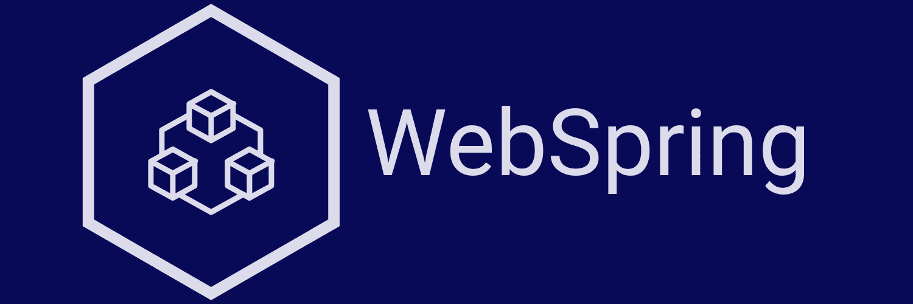

# WebSpring [](https://circleci.com/gh/ttimot24/WebSpring) [](https://app.codacy.com/app/ttimot24/WebSpring?utm_source=github.com&utm_medium=referral&utm_content=ttimot24/WebSpring&utm_campaign=Badge_Grade_Dashboard) [](https://www.codacy.com/manual/ttimot24/WebSpring?utm_source=github.com&utm_medium=referral&utm_content=ttimot24/WebSpring&utm_campaign=Badge_Coverage)
Enterprise Spring App Skeleton


### Integrated services
 - CircleCI
 - Sentry
 - Postman

### Technology
 - Spring 5
 - Log4J2
 - Hibernate 5
 - Bootstrap 4.1
 - Glassfish 4.1
 - Jolokia 1.6

#### Deployed App on Heroku:
https://webspring24.herokuapp.com/

> Username & password: admin/admin

#### Standalone run
```java -jar target/dependency/webapp-runner.jar target/WebSpring-1.0-SNAPSHOT.war``` or **```./WebSpring.sh```**
